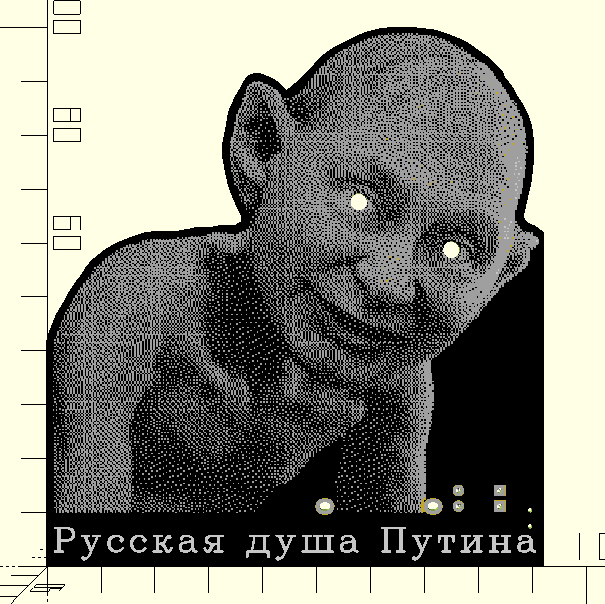

# STEM4ukraine-Russian-Soul

Build this fun project to learn about russian spirituality and soulfulness, as discussed by Dostoevsky.

A simple and fun school wearable STEM project demonstrating simple through hole soldering and analogue electronics using a CR2032 battery to power the circuit.

The circuit is very simple, using a pair of resistors and USB power to drive the LEDs used as eyes.

If you like this, you should also check out the desktop ornament in the STEM4ukraine-My-Precious repository!

The PCB allows for power to be provided by external cabling instead of a battery, allowing for decorative chains of PCBs. Something to put up for christmas perhaps?

The prototype is currently undergoing manufacturing and testing

An openscad render of the front of the PCB:

The Russian Soul wearable pendant schematic:

